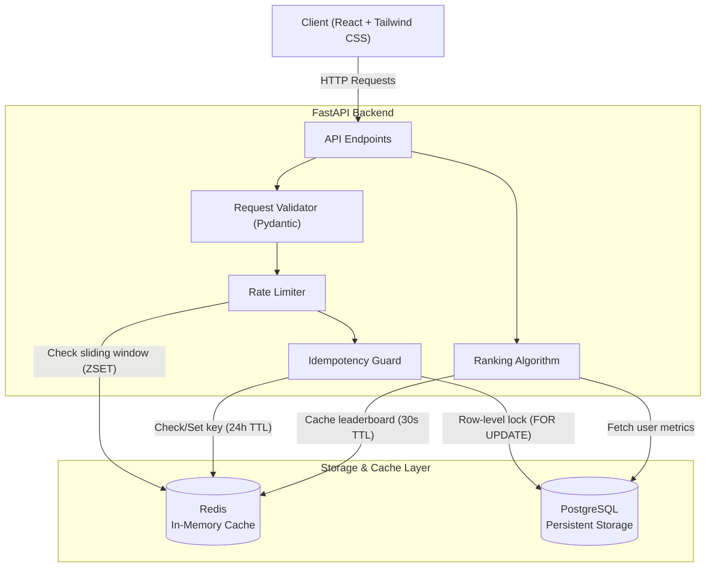
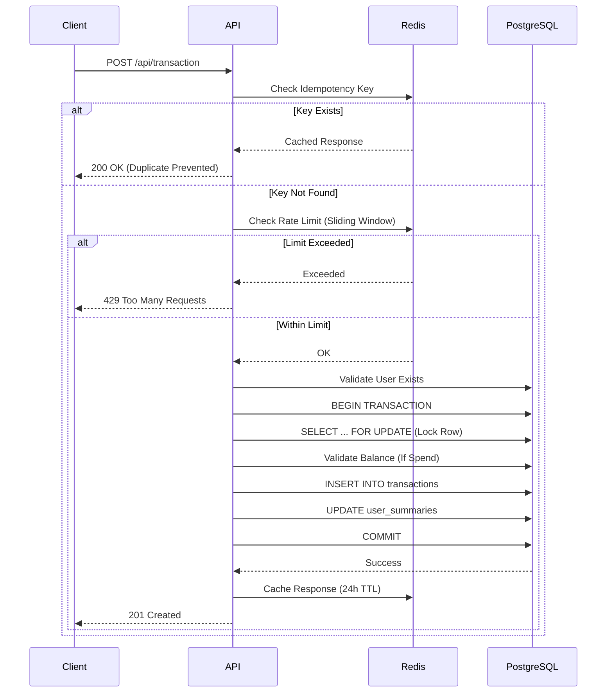

# Transaction Ranking System

A full-stack application demonstrating backend system design with **FastAPI**, **PostgreSQL**, **Redis**, **React**, **Tailwind CSS**, and **Docker**. The system provides transaction management, user analytics, and a multi-factor ranking leaderboard with built-in safeguards for data consistency, duplicate prevention, and abuse protection.

---

## Live Deployment

**Live URL:** [https://idr-transaction-system.onrender.com](https://idr-transaction-system.onrender.com)

**Deployment Notes (Render Free Tier):**
- **Cold Starts:** The web service will automatically "sleep" after 15 minutes of inactivity. When you visit the URL after it has been asleep, it may take 30–60 seconds for the application to spin back up. 
- **Database Expiration:** The free-tier PostgreSQL database provided by Render will automatically expire 30 days after creation.
- **Continuous Deployment:** The application is connected to this repository and automatically redeploys from the `master` branch via `render.yaml` infrastructure-as-code.

---

## Architecture



| Layer | Technology | Purpose |
|-------|-----------|---------|
| API | FastAPI (Python) | Async REST endpoints, Pydantic validation |
| Database | PostgreSQL | ACID transactions, row-level locking, NUMERIC for monetary precision |
| Cache | Redis | Idempotency keys (24h TTL), rate limiting (sliding window), ranking cache (30s TTL) |
| Frontend | React + Tailwind CSS v4 | Responsive SPA with glassmorphism dark theme |
| Infrastructure | Docker Compose | One-command orchestration of all services |

---

## Getting Started

### Prerequisites

- Docker & Docker Compose **OR**
- Python 3.12+, Node.js 20+, PostgreSQL, Redis

### Run with Docker (Recommended)

```bash
git clone https://github.com/Mahizhan-S/Institute_Of_Digital_Risk.git
cd Institute_Of_Digital_Risk
docker compose up --build
```

Open **http://localhost:8000** — the app seeds 5 demo users automatically.

### Run Locally

```bash
# Start databases
docker compose up postgres redis -d

# Backend
conda activate transaction_ranking   # or use any Python 3.12 env
pip install -r requirements.txt
uvicorn backend.main:app --reload --port 8000

# Frontend (separate terminal)
cd frontend && npm install && npm run dev
```

---

## API Reference

Interactive Swagger docs available at **http://localhost:8000/docs**

### POST `/api/transaction`

Creates a new earn or spend transaction with idempotency protection.

```json
{
  "userId": "user_1",
  "type": "earn",
  "amount": 150.00,
  "description": "Completed risk assessment",
  "idempotencyKey": "txn-1719208800000-abc123"
}
```

| Status | Meaning |
|--------|---------|
| `201` | Transaction created |
| `200` | Duplicate detected — cached response returned |
| `400` | Validation error or insufficient balance |
| `404` | User not found |
| `429` | Rate limit exceeded (10/min) |

### GET `/api/summary/{userId}`

Returns aggregated stats: total earned, total spent, net balance, transaction count, and last activity timestamp.

### GET `/api/ranking`

Returns a ranked leaderboard scored by a multi-factor algorithm (details below). Results are cached in Redis for 30 seconds.

---

## Design Decisions

### 1. Ranking Algorithm

A single-factor ranking (e.g., highest balance wins) is trivially gamed. The system uses a **weighted multi-factor score**:

| Factor | Weight | Rationale |
|--------|--------|-----------|
| Net Balance | 40% | Rewards financial standing |
| Transaction Count | 35% | Rewards consistent engagement |
| Avg Transaction Value | 25% | Rewards meaningful activity |

Each factor is **min-max normalized** (0–100) across all users, then combined:

```
score = 0.40 × norm(balance) + 0.35 × norm(count) + 0.25 × norm(avg_value)
```

This means a user cannot rank #1 by simply making one massive transaction or by spamming tiny ones — they need balanced, sustained activity.

### 2. Duplicate Request Prevention (Idempotency)

**Problem**: Network retries, double-clicks, or client bugs can send the same transaction twice.

**Solution — Two layers**:

| Layer | Mechanism | Speed |
|-------|-----------|-------|
| Redis | `idempotency:{key}` cached for 24h | ~1ms lookup |
| PostgreSQL | `UNIQUE` constraint on `idempotency_key` column | DB-level safety net |

**Flow**: Client generates a unique `idempotencyKey` per transaction → server checks Redis first → if found, returns cached response (HTTP 200) → if not, processes and caches result. Even if a race condition bypasses Redis, the DB UNIQUE constraint prevents a duplicate row.

### 3. Concurrency & Data Consistency

**Problem**: Two simultaneous transactions for the same user could corrupt the balance (lost update).

**Solution**: PostgreSQL's `SELECT ... FOR UPDATE` acquires a **row-level lock** on the user's summary before reading the balance. The second concurrent request blocks until the first commits. The transaction INSERT and summary UPDATE execute in a **single database transaction** — both succeed or both roll back.

```sql
-- This locks the row until COMMIT
SELECT net_balance FROM user_summaries WHERE user_id = $1 FOR UPDATE;
-- Then atomically:
INSERT INTO transactions (...) VALUES (...);
UPDATE user_summaries SET net_balance = net_balance + $2 WHERE user_id = $1;
COMMIT;
```

### 4. Rate Limiting

Redis **sorted set sliding window** — each user is limited to 10 transactions per 60-second window. The algorithm:

1. Remove entries older than 60s (`ZREMRANGEBYSCORE`)
2. Count remaining entries (`ZCARD`)  
3. If count ≥ 10 → reject (HTTP 429)
4. Otherwise → add current timestamp and allow

### 5. Input Validation & Security

| Measure | Implementation |
|---------|---------------|
| Schema validation | Pydantic models with type constraints, regex patterns, length limits |
| SQL injection | Parameterized queries (`$1`, `$2`) via asyncpg — no string interpolation |
| XSS prevention | HTML tags stripped from description field |
| Amount cap | Max $10,000 per transaction |
| Balance guard | Spend transactions rejected if amount > current balance |
| Security headers | `X-Content-Type-Options`, `X-Frame-Options`, `CSP`, `Referrer-Policy` |

---

## Database Schema

```sql
users (id, name, created_at)
  │
  ├── transactions (id, idempotency_key[UNIQUE], user_id[FK], type, amount, description, created_at)
  │
  └── user_summaries (user_id[PK/FK], total_earned, total_spent, net_balance, transaction_count, last_transaction_at)
```

- `NUMERIC(12,2)` for all monetary fields (avoids floating-point errors)
- `user_summaries` is updated **atomically** with each transaction — never out of sync
- Indexes on `user_id`, `created_at`, and `net_balance DESC` for query performance

---

## Data Flow



---

## Project Structure

```
├── backend/
│   ├── __init__.py        # Package exports
│   ├── main.py            # FastAPI routes and app lifecycle
│   ├── database.py        # PostgreSQL pool, schema, queries
│   ├── models.py          # Pydantic request/response models
│   ├── ranking.py         # Multi-factor scoring algorithm
│   ├── rate_limiter.py    # Redis sliding window limiter
│   ├── redis_client.py    # Redis connection and cache helpers
│   ├── security.py        # Security headers middleware
│   └── seed_data.py       # Demo data seeder (5 users, 27 transactions)
├── frontend/
│   ├── src/
│   │   ├── App.jsx                  # Root component (3-column layout)
│   │   ├── api.js                   # Fetch wrappers for all endpoints
│   │   ├── main.jsx                 # React entry point
│   │   ├── index.css                # Tailwind v4 + custom theme
│   │   └── components/
│   │       ├── TransactionForm.jsx  # Create transaction form
│   │       ├── UserSummary.jsx      # User stats display
│   │       ├── RankingTable.jsx     # Leaderboard with score bars
│   │       └── Toast.jsx            # Notification component
│   ├── index.html
│   ├── vite.config.js
│   └── package.json
├── Dockerfile             # Multi-stage build (Node → Python)
├── docker-compose.yml     # PostgreSQL + Redis + App
├── requirements.txt       # Python dependencies
└── README.md
```

---

## Mock Data

The app seeds 5 users on first startup, each representing a different usage pattern:

| User | Pattern | Purpose |
|------|---------|---------|
| Alice Johnson | High volume, high value | Tests top-ranked behavior |
| Bob Smith | Moderate, balanced | Tests mid-range ranking |
| Charlie Brown | Many small transactions | Tests count-heavy ranking |
| Diana Prince | Few large transactions | Tests value-heavy ranking |
| Eve Williams | New user, minimal activity | Tests bottom-of-leaderboard |

---

## Trade-offs & Limitations

- **No authentication** — users identified by ID only. Production would use JWT/OAuth.
- **Ranking cache staleness** — 30s TTL means rankings may lag by up to 30 seconds after a transaction.
- **Single-process rate limiter** — works because Redis is shared, but no distributed lock for the rate check itself.
- **No pagination** — ranking returns all users. Would need cursor-based pagination at scale.
- **SQLite not used** — PostgreSQL was chosen deliberately for row-level locking and NUMERIC type, despite being heavier for a demo.

---

## Tech Stack Summary

| | Technology |
|-|-----------|
| Language | Python 3.12 |
| Framework | FastAPI 0.115 |
| Database | PostgreSQL 16 |
| Cache | Redis 7 |
| Frontend | React 19 + Tailwind CSS v4 |
| Build | Vite 8 |
| Container | Docker + Docker Compose |
| Validation | Pydantic v2 |
